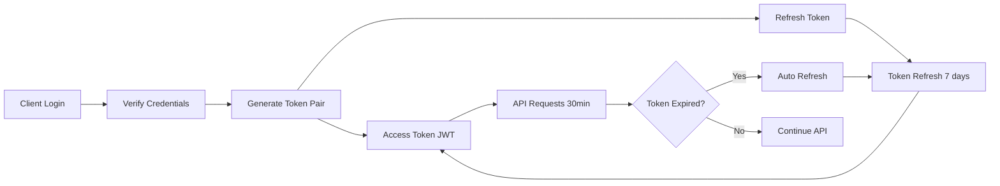
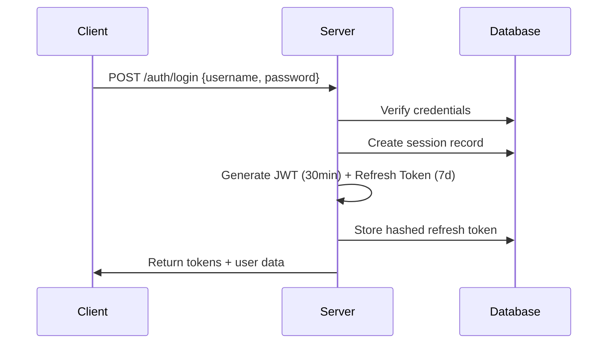
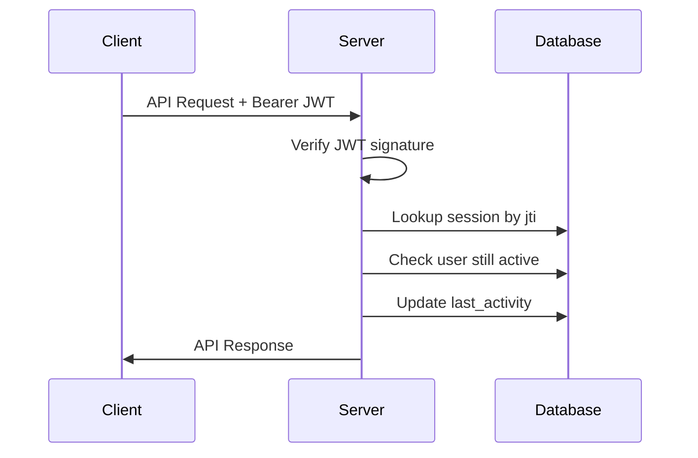
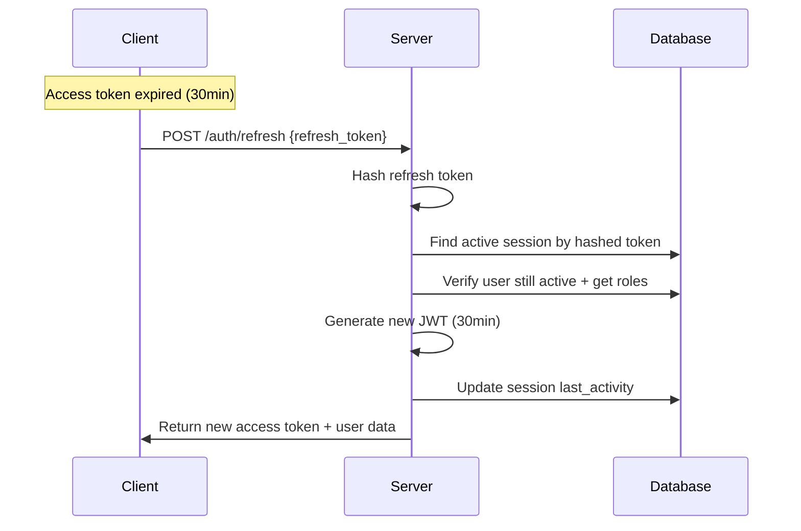
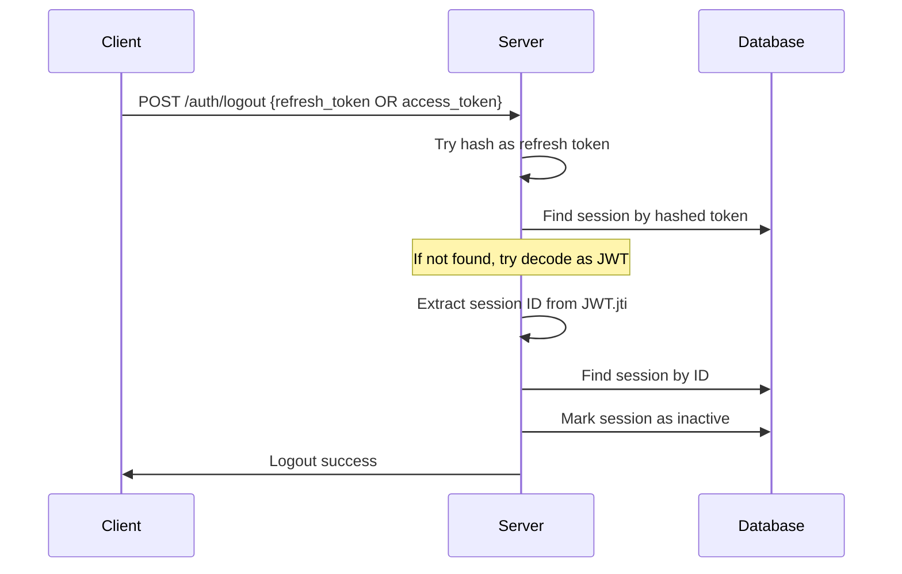

# 🔐 Authentication Token System Documentation

## Tổng Quan Hệ Thống Token

Hệ thống IoMT sử dụng dual-token authentication với **Access Token** (JWT) và **Refresh Token** để đảm bảo security và user experience tối ưu.

---

## 📊 Kiến Trúc Token System



---

## 🎯 Access Token (JWT)

### Đặc Điểm
- **Format**: JSON Web Token (JWT) 
- **Algorithm**: HS256 (HMAC SHA-256)
- **Lifetime**: 30 phút
- **Storage**: Memory/Local Storage (client)
- **Purpose**: Authentication cho API requests

### Cấu Trúc JWT Payload

```json
{
  "sub": "uuid-user-id",           // Subject: User ID
  "jti": "uuid-session-id",        // JWT ID: Session identifier  
  "username": "john.doe",
  "full_name": "John Doe",
  "email": "john@example.com",
  "organization_id": "uuid-org",
  "department_id": "uuid-dept",
  "roles": [                       // User roles with permissions
    {
      "id": "uuid-role",
      "name": "admin",
      "permissions": ["read", "write", "delete"]
    }
  ],
  "iat": 1698729600,              // Issued At (timestamp)
  "exp": 1698731400               // Expires At (iat + 30 min)
}
```

### Validation Process

```javascript
// 1. JWT Signature Verification
const decoded = jwt.verify(accessToken, process.env.JWT_SECRET);

// 2. Session Lookup (via jti)
const session = await prisma.user_sessions.findFirst({
  where: {
    id: decoded.jti,              // Session UUID từ JWT
    is_active: true,
    expires_at: { gt: new Date() }
  }
});

// 3. Inactivity Check (30 phút timeout)
const timeDiff = now - session.last_activity;
if (timeDiff > SESSION_TIMEOUT) {
  // Auto logout
}

// 4. Update Activity Timestamp
await prisma.user_sessions.update({
  where: { id: session.id },
  data: { last_activity: new Date() }
});
```

---

## 🔄 Refresh Token

### Đặc Điểm
- **Format**: Random hex string (128 characters)
- **Algorithm**: crypto.randomBytes(64).toString('hex')
- **Lifetime**: 7 ngày
- **Storage**: Database (hashed), HTTP-only cookie (client)
- **Purpose**: Renew access tokens without re-login

### Generation & Storage

```javascript
// 1. Generate Random Token
const refreshToken = crypto.randomBytes(64).toString('hex');
// → "a1b2c3d4e5f6..."

// 2. Hash for Database Storage  
const hashedToken = crypto.createHash('sha256')
  .update(refreshToken)
  .digest('hex');
// → "7d8e9f10a1b2..."

// 3. Store in Database
await prisma.user_sessions.create({
  data: {
    user_id: userId,
    refresh_token: hashedToken,    // ⚠️ ONLY hashed version stored
    expires_at: new Date(Date.now() + 7 * 24 * 60 * 60 * 1000)
  }
});

// 4. Send to Client (plain text)
res.cookie('refresh_token', refreshToken, {
  httpOnly: true,
  secure: true,
  maxAge: 7 * 24 * 60 * 60 * 1000
});
```

### Refresh Process Flow

```javascript
// 1. Client gửi refresh token
POST /auth/refresh
{
  "refresh_token": "a1b2c3d4e5f6...",
  "session_id": "uuid-session" // Optional constraint
}

// 2. Hash token để lookup
const hashedToken = crypto.createHash('sha256')
  .update(refreshToken)
  .digest('hex');

// 3. Find active session
const session = await prisma.user_sessions.findFirst({
  where: {
    refresh_token: hashedToken,
    is_active: true,
    expires_at: { gt: new Date() }
  }
});

// 4. Validate user is still active
const user = await prisma.users.findFirst({
  where: { 
    id: session.user_id,
    is_active: true 
  }
});

// 5. Generate new access token
const newAccessToken = jwt.sign(userPayload, JWT_SECRET, {
  expiresIn: '30m',
  jwtid: session.id
});

// 6. Update session activity
await prisma.user_sessions.update({
  where: { id: session.id },
  data: { 
    last_activity: new Date(),
    ip_address: clientIP  // Update if changed
  }
});
```

---

## 🏗️ Database Schema

### user_sessions Table

```sql
CREATE TABLE user_sessions (
  id UUID PRIMARY KEY DEFAULT gen_random_uuid(),
  user_id UUID NOT NULL REFERENCES users(id),
  
  -- Token Storage
  access_token VARCHAR(255),              -- Session identifier (deprecated)
  refresh_token VARCHAR(255) NOT NULL,    -- Hashed refresh token
  
  -- Session Metadata
  device_info JSONB,                      -- Browser/device info
  ip_address INET,                        -- Client IP address
  
  -- Lifecycle
  is_active BOOLEAN DEFAULT true,
  created_at TIMESTAMP DEFAULT NOW(),
  last_activity TIMESTAMP DEFAULT NOW(),
  expires_at TIMESTAMP NOT NULL,          -- Refresh token expiry
  
  -- Indexes
  INDEX idx_refresh_token (refresh_token),
  INDEX idx_user_active (user_id, is_active),
  INDEX idx_expires_active (expires_at, is_active)
);
```

---

## ⚡ Security Features

### 1. Token Hashing
```javascript
// ❌ NEVER store plain refresh tokens
refresh_token: "a1b2c3d4e5f6..."  // Plain text

// ✅ Always hash before storage
refresh_token: "7d8e9f10a1b2..."  // SHA-256 hash
```

### 2. Session Binding
```javascript
// JWT chứa session ID → Không thể replay trên session khác
{
  "jti": "uuid-session-123",  // Binds JWT to specific session
  "exp": 1698731400
}
```

### 3. Automatic Cleanup
```javascript
// Cleanup expired sessions (chạy hàng ngày)
await prisma.user_sessions.updateMany({
  where: {
    OR: [
      { expires_at: { lt: new Date() } },           // Expired tokens
      { 
        last_activity: { 
          lt: new Date(Date.now() - 60 * 60 * 1000)  // Inactive > 1 hour
        }
      }
    ],
    is_active: true
  },
  data: { is_active: false }
});
```

### 4. Suspicious Activity Detection
```javascript
// Phát hiện hoạt động đáng ngờ
const analysis = await sessionService.detectSuspiciousActivity(userId, ipAddress);

if (analysis.is_suspicious) {
  // Có thể require 2FA, gửi email warning, etc.
}
```

---

## 🔄 Token Lifecycle

### 1. Login Flow


### 2. API Request Flow


### 3. Token Refresh Flow


### 4. Logout Flow


---

## ⚙️ Configuration

### Environment Variables
```bash
# JWT Configuration
JWT_SECRET=your-super-secret-key-256-bits-minimum
NODE_ENV=production

# Session Timeouts
SESSION_TIMEOUT_MINUTES=30
REFRESH_TOKEN_DAYS=7
ACCESS_TOKEN_MINUTES=30
```

### Constants (auth.constants.js)
```javascript
export const SESSION_CONFIG = {
    ACCESS_TOKEN_EXPIRES_IN: 30 * 60,      // 30 minutes
    REFRESH_TOKEN_EXPIRES_IN: 7 * 24 * 60 * 60,  // 7 days
    SESSION_CLEANUP_INTERVAL: 24 * 60 * 60 * 1000, // 24 hours
    MAX_SESSIONS_PER_USER: 5
};
```

---

## 🛠️ Usage Examples

### Client-side Token Management

```javascript
class AuthService {
  constructor() {
    this.accessToken = localStorage.getItem('access_token');
    this.refreshToken = this.getCookie('refresh_token');
  }

  async makeAuthenticatedRequest(url, options = {}) {
    // 1. Try with current access token
    let response = await fetch(url, {
      ...options,
      headers: {
        ...options.headers,
        'Authorization': `Bearer ${this.accessToken}`
      }
    });

    // 2. If 401, try refresh
    if (response.status === 401) {
      const refreshed = await this.refreshAccessToken();
      
      if (refreshed) {
        // Retry with new token
        response = await fetch(url, {
          ...options,
          headers: {
            ...options.headers,
            'Authorization': `Bearer ${this.accessToken}`
          }
        });
      } else {
        // Redirect to login
        window.location.href = '/login';
        return;
      }
    }

    return response;
  }

  async refreshAccessToken() {
    try {
      const response = await fetch('/auth/refresh', {
        method: 'POST',
        credentials: 'include',  // Include refresh_token cookie
        headers: {
          'Content-Type': 'application/json'
        },
        body: JSON.stringify({
          refresh_token: this.refreshToken
        })
      });

      if (response.ok) {
        const data = await response.json();
        this.accessToken = data.data.access_token;
        localStorage.setItem('access_token', this.accessToken);
        return true;
      }
    } catch (error) {
      console.error('Refresh failed:', error);
    }
    
    return false;
  }
}
```

### Server-side Middleware

```javascript
// authMiddleware.js
export const authMiddleware = async (req, res, next) => {
  try {
    const authHeader = req.headers.authorization;
    
    if (!authHeader?.startsWith('Bearer ')) {
      return res.status(401).json({
        success: false,
        error: 'Access token required',
        code: 'AUTH_TOKEN_MISSING'
      });
    }

    const accessToken = authHeader.substring(7);
    const sessionInfo = await sessionService.validateAccessToken(accessToken);
    
    if (!sessionInfo) {
      return res.status(401).json({
        success: false,
        error: 'Invalid or expired access token',
        code: 'AUTH_TOKEN_INVALID'
      });
    }

    // Attach user info to request
    req.user = sessionInfo.user;
    req.session = {
      id: sessionInfo.session_id,
      ip_address: sessionInfo.ip_address,
      device_info: sessionInfo.device_info
    };
    
    next();
  } catch (error) {
    console.error('Auth middleware error:', error);
    res.status(500).json({
      success: false,
      error: 'Authentication failed',
      code: 'AUTH_INTERNAL_ERROR'
    });
  }
};
```

---

## 📈 Monitoring & Analytics

### Session Statistics
```javascript
// Get session analytics
const stats = await sessionService.getSessionStatistics();
console.log(stats);
// {
//   total: 1250,
//   active: 89,
//   expired: 1161,
//   cleanup_needed: 1161
// }
```

### User Session Management
```javascript
// Get user's active sessions
const sessions = await sessionService.getUserActiveSessions(userId);
console.log(sessions);
// [
//   {
//     id: "uuid-session-1",
//     device_info: { browser: "Chrome", platform: "Windows" },
//     ip_address: "192.168.1.100",
//     last_activity: "2024-10-29T10:30:00Z",
//     created_at: "2024-10-29T08:00:00Z"
//   }
// ]

// Terminate specific session
await sessionService.terminateSession(sessionId, requesterId);
```

---

## ⚠️ Security Best Practices & Critical Fixes

### 🚨 **CRITICAL SECURITY FIXES IMPLEMENTED**

#### 1. **Mandatory Session Validation**
```javascript
// ❌ OLD: JWT verification only
const decoded = jwt.verify(accessToken, JWT_SECRET);

// ✅ NEW: Always validate session in database
const session = await prisma.user_sessions.findFirst({
  where: {
    id: decoded.jti,
    is_active: true,
    expires_at: { gt: new Date() }
  }
});

if (!session) {
  return res.status(401).json({ error: 'Session revoked' });
}
```

#### 2. **JWT Payload Security**
```javascript
// ❌ OLD: Full permissions in JWT (stale data risk)
{
  "roles": [{"name": "admin", "permissions": ["read", "write"]}]
}

// ✅ NEW: Only role IDs in JWT
{
  "role_ids": ["uuid-role-1", "uuid-role-2"]
}

// Middleware always gets fresh permissions from database
const permissions = await getUserAllPermissions(userId);
```

#### 3. **Refresh Token Rotation**
```javascript
// ❌ OLD: Same refresh token reused
POST /auth/refresh → Returns new access token only

// ✅ NEW: Both tokens rotated
POST /auth/refresh → Returns {
  access_token: "new-jwt",
  refresh_token: "new-refresh-token"  // ← Prevents replay attacks
}
```

#### 4. **Inactivity Timeout Enforcement**
```javascript
// ✅ NEW: 30-minute inactivity check
const inactiveTime = now - session.last_activity;
if (inactiveTime > 30 * 60 * 1000) {
  await prisma.user_sessions.update({
    where: { id: session.id },
    data: { is_active: false }
  });
  return res.status(401).json({ error: 'Session timeout' });
}
```

#### 5. **IP Change Detection**
```javascript
// ✅ NEW: Monitor IP address changes
if (clientIP !== session.ip_address) {
  console.log('⚠️ IP changed:', {
    old_ip: session.ip_address,
    new_ip: clientIP,
    user: session.user.username
  });
  // Update IP and log security event
}
```

### 1. Token Storage
- ✅ **Access Token**: Memory/localStorage (client-side)
- ✅ **Refresh Token**: HTTP-only cookie + hashed in database + rotation
- ❌ **Never**: Store refresh tokens in localStorage
- ✅ **New**: Refresh tokens rotate on every use

### 2. Token Transmission
- ✅ **HTTPS Only** for production
- ✅ **SameSite=Strict** cookies
- ✅ **Secure flag** for cookies in production
- ✅ **New**: Client must handle refresh token rotation

### 3. Session Security
- ✅ Hash refresh tokens before database storage
- ✅ Bind JWT to specific session (jti)
- ✅ **New**: Mandatory session validation on every request
- ✅ **New**: Real-time permission checking from database
- ✅ **New**: Inactivity timeout enforcement (30 minutes)
- ✅ Regular cleanup of expired sessions
- ✅ Monitor suspicious login patterns + IP changes

### 4. Error Handling
- ✅ Generic error messages (avoid information leakage)
- ✅ Rate limiting on auth endpoints
- ✅ Audit logging for security events
- ✅ **New**: Specific error codes for different failure types

---

## 🔧 Troubleshooting

### Common Issues

#### 1. "Invalid or expired refresh token"
```bash
# Debug refresh token
POST /auth/debug-token
{
  "refresh_token": "a1b2c3d4...",
  "simulate_refresh": true
}
```

#### 2. "Session not found"
```bash
# Check user sessions
GET /auth/debug-sessions/:userId
```

#### 3. JWT Verification Failed
```bash
# Check JWT_SECRET and algorithm
console.log('JWT_SECRET exists:', !!process.env.JWT_SECRET);
console.log('JWT_SECRET length:', process.env.JWT_SECRET?.length);
```

### Debug Tools (Development Only)
```javascript
// Available debug endpoints (NODE_ENV !== 'production')
POST /auth/debug-token        // Analyze refresh token issues
GET /auth/debug-sessions/:id  // View user sessions
```

---

## 📚 API Reference

### Authentication Endpoints

| Endpoint | Method | Purpose | Auth Required |
|----------|---------|---------|---------------|
| `/auth/login` | POST | User login | ❌ |
| `/auth/logout` | POST | User logout | ✅ |
| `/auth/refresh` | POST | Refresh access token | ❌ |
| `/auth/verify` | GET | Verify session | ✅ |

### Profile Endpoints

| Endpoint | Method | Purpose | Auth Required |
|----------|---------|---------|---------------|
| `/auth/profile` | GET | Get user profile | ✅ |
| `/auth/me` | GET | Get full user data | ✅ |
| `/auth/profile` | PATCH | Update profile | ✅ |
| `/auth/permissions` | GET | Get user permissions | ✅ |

### Password Management

| Endpoint | Method | Purpose | Auth Required |
|----------|---------|---------|---------------|
| `/auth/change-password` | POST | Change password | ✅ |

---

## 📋 Migration Notes

### From Old System
1. **Token Storage**: Migrated from storing access tokens in DB to JWT-only
2. **Session Binding**: Added `jti` (session ID) to JWT payload
3. **Refresh Security**: Now hashing refresh tokens before storage
4. **Cleanup**: Automated expired session cleanup

### Breaking Changes
- `access_token` field in `user_sessions` is deprecated
- JWT `jti` now contains session UUID instead of token string
- Refresh tokens are hashed in database (breaking old tokens)

---

## 🛡️ **SECURITY VULNERABILITY FIXES**

### ❌ **Problems Identified & Fixed**

#### 1. **JWT Permissions Stale Data**
- **Problem**: Admin revokes user role → JWT still valid for 30 minutes
- **Risk**: Cannot revoke permissions immediately (critical security flaw)  
- **Fix**: JWT only contains role_ids, middleware fetches fresh permissions

#### 2. **Missing Session Validation**
- **Problem**: JWT signature valid but session revoked in database
- **Risk**: User continues access after admin revokes session
- **Fix**: Every request validates session existence and status

#### 3. **Refresh Token Replay Attacks**
- **Problem**: Same refresh token reused → stolen token works forever
- **Risk**: Attacker uses stolen refresh token for 7 days
- **Fix**: Refresh token rotation - new token on every refresh

#### 4. **No Inactivity Enforcement**
- **Problem**: JWT valid for 30 minutes regardless of activity
- **Risk**: Abandoned sessions remain active
- **Fix**: 30-minute inactivity timeout with auto-logout

#### 5. **Race Conditions**
- **Problem**: Multiple tabs refresh simultaneously → inconsistent state
- **Risk**: Session data corruption
- **Fix**: Database versioning with optimistic locking

### 📊 **Security Comparison**

| Aspect | Before Fix | After Fix | Impact |
|--------|------------|-----------|---------|
| **Permission Revocation** | ❌ 30min delay | ✅ Immediate | Critical |
| **Session Hijacking** | ❌ Hard to detect | ✅ Auto-detection | High |
| **Replay Attacks** | ❌ Vulnerable | ✅ Prevented | High |
| **Inactive Sessions** | ❌ Not enforced | ✅ Auto-logout | Medium |
| **Race Conditions** | ❌ Possible | ✅ Prevented | Medium |

### 🎯 **Implementation Status**

- ✅ **COMPLETED**: Mandatory session validation
- ✅ **COMPLETED**: JWT payload security (role_ids only)  
- ✅ **COMPLETED**: Refresh token rotation
- ✅ **COMPLETED**: Inactivity timeout enforcement
- ✅ **COMPLETED**: IP change detection
- 📋 **PENDING**: Database schema migration (version field)
- 📋 **PENDING**: Client-side refresh token rotation handling
- 📋 **PENDING**: Enhanced session cleanup with user limits

### ⚠️ **Breaking Changes**

1. **Refresh Token Response**: Now returns both access_token AND new refresh_token
2. **JWT Structure**: Contains role_ids instead of full role objects  
3. **Session Validation**: All requests now query database for session status
4. **Middleware**: Always fetches fresh permissions from database

### 🔧 **Client Migration Required**

```javascript
// ❌ OLD: Only handle access token
const { access_token } = await fetch('/auth/refresh').then(r => r.json());
localStorage.setItem('access_token', access_token);

// ✅ NEW: Handle both tokens  
const { access_token, refresh_token } = await fetch('/auth/refresh').then(r => r.json());
localStorage.setItem('access_token', access_token);
// Store new refresh token securely (cookie will be auto-updated)
```

---

*Last updated: October 29, 2024*  
*Security fixes implemented: October 29, 2024*